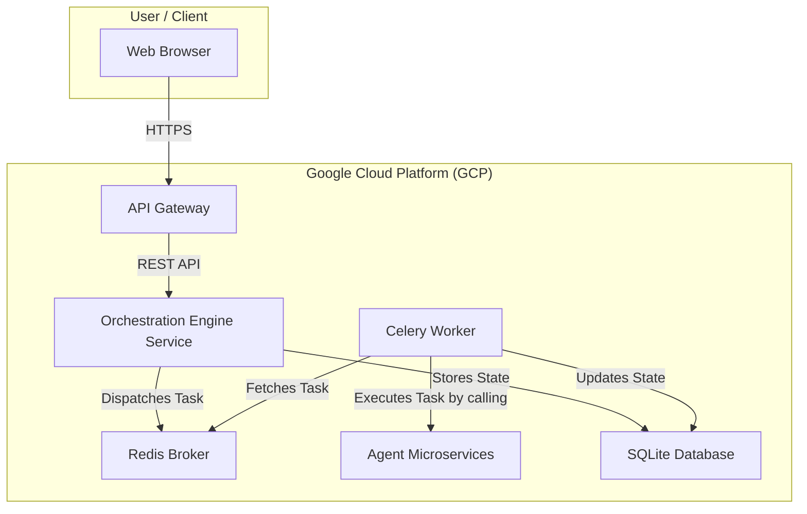
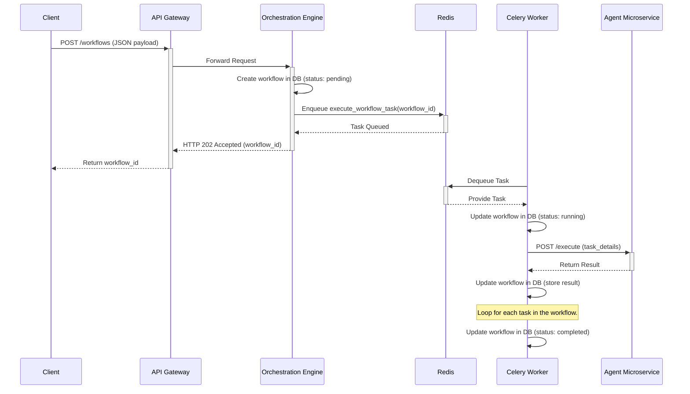

# Software Architecture Document

## 1. High-Level System Architecture

This document outlines the software architecture for the multi-agent AI platform. The platform is designed as a cloud-native, microservices-based system to ensure scalability, resilience, and maintainability.

### 1.1. Architectural Diagram

This diagram illustrates the high-level architecture of the platform, showing the key components and their interactions.

### 1.2. Architectural Goals
- **Scalability:** The architecture must support a large number of concurrent agents and tenants.
- **Reliability:** The system must be highly available with a 99.9% uptime SLA.
- **Flexibility:** The platform should be easily extensible to accommodate new agents and features.
- **Security:** A security-first approach is paramount.
- **Maintainability:** The microservices architecture enables independent development and deployment.

### 1.3. Core Components
- **Orchestration Engine:** The core service that manages workflows.
- **Agent Microservices:** Standalone services, each implementing a specific agent's logic.
- **API Gateway:** A single, secure entry point for all external traffic.
- **Task Queue (Celery/Redis):** An asynchronous task queue for executing long-running workflows.
- **Database (SQLite/PostgreSQL):** Persists workflow state and other critical data.

## 2. Component Architecture
... (sections 2.1 to 2.5 remain the same) ...

## 3. Data Flow for Workflow Execution

This diagram details the sequence of events when a new workflow is created and executed.

... (sections 4 to 7 remain the same) ...
